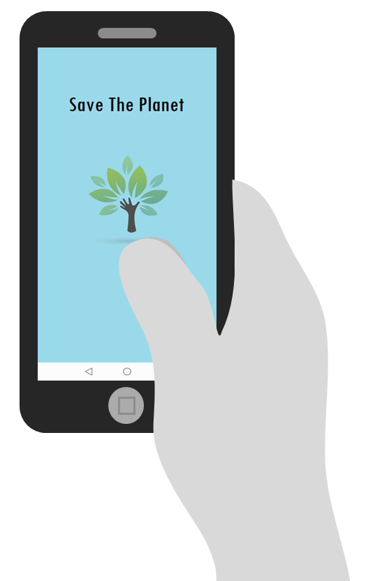
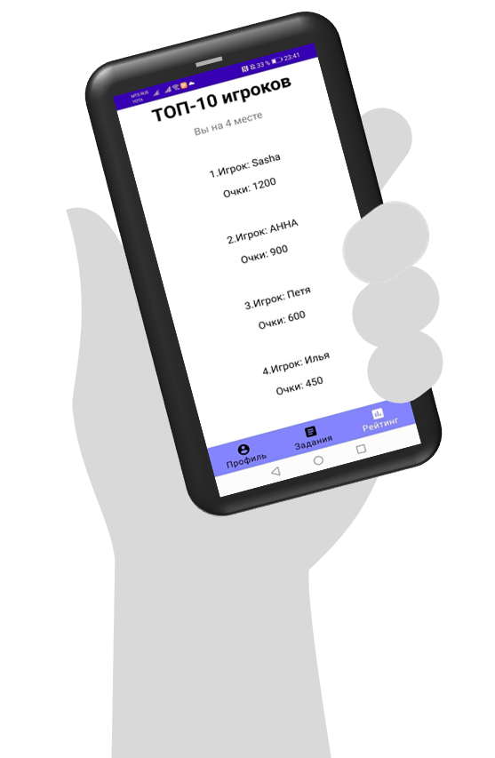

# Android приложение Save The Planet
Приложение развивает в детях желание помешать глобальному потеплению.
Пользователь должен выполнять задания, за которые он получит очки и отобразится в глобальном рейтинге всех участников приложения.

Для приложения написан сервер с использованием хостинга Heroku и базой данных в СУБД PostgreSQL Heroku.
Формат данных в базе данных:
`[{"name":"test1","score":5}, ..., {"name":"test2","score":10}]`

Интерфейсы
 - `JsonPlaceHolderApi.java`
 - `JsonPlaceHolderApi2.java`
 - `UsersInfo.java`
 - `UsersInfoUpdate.java`
используются для генерации запроса к серверу.

При открытии приложения отображается Splash Screen. За это отвечает активность `splash.java`
Если пользователь впервые зашёл в приложение, то ему необходимо зарегистрироваться. Тогда после активности с Splash Screen открывается активность `MainActivity.java`, где пользователю необходимо указать желаемый никнейм, после чего приложение, используя библиотеку Retrofit, отправляет запрос на сервер для проверки, нет ли уже ранее зарегистрированного пользователя с таким же никнеймом: 
`https://young-reaches-53543.herokuapp.com/list_all`

Если ник пользователя уникален, то мы сохраняем его в `Shared Preferences` и открываем активность `SecondActivity.java`.
Перед пользователем отображается список заданий, за каждое выполнение которого ему будут начисляться очки. Все задания определены в активности `Itemactivity.java`.
Статус каждого задания сохраняется в Shared Preferences.

Пользователь может переключаться между активностями, используя `Bottom Navigation`.
За профиль отвечает активность `Profile.java`, где отображается информация:
 - `картинка`
 - `ник`
 - `количество выполненных заданий`
 - `количество очков`

Также в Bottom Navigation есть активность с глобальным рейтингом - `Rating.java`.
Отравляется запрос на страницу `https://young-reaches-53543.herokuapp.com` и, используя интерфейс `JsonPlaceHolderApi`, уже обрабатывается URL-адрес 
`https://young-reaches-53543.herokuapp.com/list_top`, где с помощью SQL запроса выводится список пользователей, отсортированных по убыванию очков.
В активности выводится ТОП-10 игроков по очкам. Также приложение покажет, на каком месте мы находимся.

 
 
 

Если после ввода никнейма и нажатия кнопки "Далее" ничего не происходит, то следует перезапустить приложение.
Используются бесплатные права на хостинге, поэтому стоит ограничение: если на сервер не отправляются запросы в течение 30 минут, то он затухает. Поэтому следует еще раз отправить запрос - перезапустить приложение и снова ввести никнейм при регистрации.
